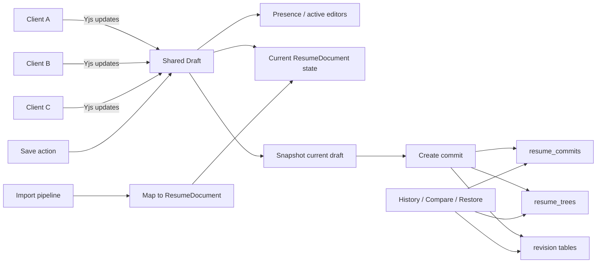

# Collaborative Draft Editing Model

Date: 2026-04-09
Status: Early design sketch

## Summary

Current resume editing is shaped by a Git-like version model:
- commits are immutable snapshots
- branches represent alternate lines of history
- save operations create version history directly

This works well for explicit versioning, but it is a clumsy fit for a Google Docs-like editing experience. For collaborative editing, the cleaner mental model is:

- `draft` = the live shared working copy
- `commit` = an explicit saved version
- `branch` = an intentional alternate track, only when the user explicitly wants one

Under this model, users do not edit commits directly. They edit a shared draft that syncs in real time. When they are ready, the system snapshots that draft into a commit.

## Proposed Editing Flow

1. User opens a resume for editing.
2. Backend loads or creates a shared draft for that resume.
3. Clients attach to the draft through realtime sync.
4. Changes are applied to the draft continuously.
5. Other connected clients receive the same changes immediately.
6. When a user clicks `Save`, backend snapshots the current draft into a new commit.
7. History, compare, restore, and export continue to operate on commits.

## Core Principle

Separate live editing from version history.

That means:
- draft is optimized for collaboration and editing ergonomics
- commit is optimized for history, traceability, compare, and restore

Trying to use branches and commits as the live editing mechanism adds complexity that is not necessary for normal editing sessions.

## Recommended Architecture

### 1. Shared Draft

Introduce a server-owned draft for each actively edited resume.

Suggested responsibility:
- holds the current editable document state
- accepts realtime updates from connected users
- broadcasts updates to other users
- tracks who is present in the document

This draft can be represented as a full `ResumeDocument`.

### 2. Yjs For Realtime Sync

Use Yjs to synchronize draft state between connected editors.

Why Yjs fits:
- supports collaborative editing well
- handles concurrent changes without building custom OT logic
- works with WebSocket providers
- can support reconnect and offline buffering more naturally than ad hoc patch systems

Recommended scope:
- use Yjs as the live synchronization layer for the draft
- keep commits and trees as the persistence/versioning layer

### 3. Commit On Save

When the user clicks `Save`:
- read the current draft state
- convert it into the canonical `ResumeDocument`
- compare against current saved head if needed
- build tree + revisions
- create a new `resume_commit`
- update the main branch head

This keeps commit history meaningful. A commit becomes a deliberate save point rather than a byproduct of every small edit.

## Impact On Branching

This model removes most of the need for automatic branch creation.

Why:
- normal editing happens inside the shared draft
- there is no longer a need to create a branch just to isolate in-progress edits
- the draft itself is the working area

Branches can still exist, but they should become intentional and user-driven.

Good branch use cases:
- create an alternate version for a specific customer
- prepare a language-specific version
- explore a substantial rewrite without affecting the current main line

Poor branch use cases:
- autosave
- transient editing state
- per-session editing isolation

In other words:
- draft replaces the old need for automatic working branches
- commits remain the saved history
- branches become an advanced feature for explicit divergence

## Unifying The Data Model

A major benefit of the draft-based model is that the same document shape can be reused in more places.

Suggested shared model:
- `ResumeDocument`

Used by:
- draft editing
- import pipeline
- save version flow
- compare preparation
- restore flow

This is cleaner than having one shape for imported data, another for frontend edit state, and a third for commit persistence.

## Suggested Data Responsibilities

### Draft Layer

Possible storage concepts:
- `resume_drafts`
- `resume_draft_presence`
- optional draft metadata such as `updated_at`, `updated_by`, `base_commit_id`

Draft concerns:
- current live state
- connected collaborators
- conflict-free sync
- autosave/reconnect behavior

### Version Layer

Keep the existing persisted history concepts:
- `resume_commits`
- `resume_trees`
- revision tables

Version concerns:
- audit trail
- compare
- restore
- export
- stable saved history

## Suggested Save Contract

High-level save contract:

- input: current `ResumeDocument` draft state
- optional guard: base head commit id
- output: new commit id and updated branch head

Useful behavior:
- reject or warn if the user saves against a stale base head
- allow explicit "save anyway" or rebase/refresh behavior later if needed

## Product-Level Mental Model

The UX becomes easier to explain:

- "You are editing a shared draft"
- "Save creates a version"
- "History shows saved versions"
- "Branches are only for intentional alternate versions"

This is closer to how users already think about collaborative editors.

## Tradeoffs And Open Questions

### Benefits

- simpler everyday editing model
- collaboration fits naturally
- fewer backend writes tied to individual UI controls
- import and edit can share the same document model
- version history stays intentional and easier to understand

### Costs

- introduces a realtime system
- requires draft lifecycle management
- requires presence/session handling
- needs a policy for stale saves and conflict messaging
- requires deciding how drafts are persisted across disconnects/restarts

### Open Questions

- Should every resume always have one persistent draft, or only while active?
- Should drafts be stored purely in Yjs documents, or mirrored into relational storage?
- Should autosave create hidden checkpoints, or only update the draft state?
- How should restore work: restore into draft first, or create commit immediately?

## Recommended Starting Point

Start with a pragmatic hybrid:

1. Introduce a single canonical `ResumeDocument`.
2. Add a shared draft concept on the backend.
3. Use Yjs for realtime synchronization of draft state.
4. Keep commits as explicit save points.
5. Remove automatic branch creation from normal editing flows.
6. Retain branches only for explicit alternate-version workflows.

This gives a collaboration-friendly editing model without throwing away the useful commit/tree history model that already exists.

## Diagram

